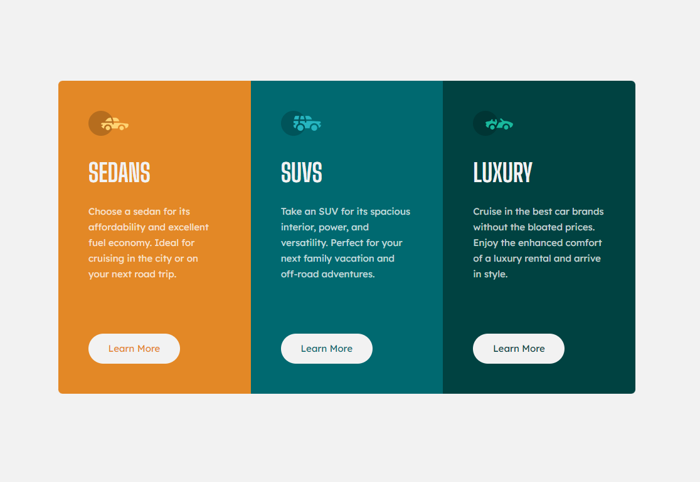

# Frontend Mentor - 3-column preview card component solução

Essa é uma solução pra o [desafio 3-column preview card component do Frontend Mentor](https://www.frontendmentor.io/challenges/3column-preview-card-component-pH92eAR2-). Desafios do Frontend Mentor ajudam você a melhorar suas habilidades de codificação criando projetos realistas. 

## Conteúdo

- [Visão Geral](#visão-geral)
  - [Desafio](#desafio)
  - [Screenshot](#screenshot)
  - [Links](#links)
- [Tecnologias Utilizadas](#tecnologias-utilizadas)
- [Autor](#autor)

## Visão Geral

### Desafio

O usuário deve conseguir:

- Ver o melhor layout independente do tamanho da tela de seu dispositivo
- Ver estados diferentes quando passar o mouse sobre elementos interativos

### Screenshot

### Links

- URL da Solução: [Solução](https://www.frontendmentor.io/solutions/componente-de-3-colunas-responsivo-criado-com-html-e-css-flexbox-h_jjCoRty3)
- URL do Live Site: [Github Page](https://robson-mariani.github.io/frontend-mentor-3-column-preview-card-component/)

## Tecnologias Utilizadas

- Marcação HTML5 semântica
- Propriedades personalizadas do CSS
- Flexbox

## Autor

- Frontend Mentor - [@robson-mariani](https://www.frontendmentor.io/profile/robson-mariani)
